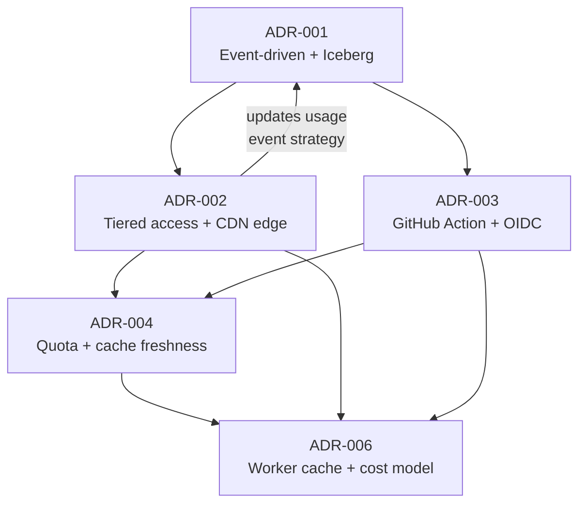

# ADR-005: Architecture Summary (Checkpoint)

**Status**: Living document
**Date**: 2026-03-21
**Authors**: @fforootd

> [!NOTE]
> This ADR is not a decision — it is a **checkpoint** that summarises the current architectural state established by ADRs 001–006. Update this document whenever an ADR is added, accepted, or superseded.

## Current Architecture at a Glance

```
User / CI / Agent
       │
       ▼
Cloudflare Worker (Hono)   ← Always invoked (~$0.30/M) — ADR-006
  ├── L1 Cache API check (~0ms, free ops)
  ├── Auth (API key / OIDC)
  ├── Rate limit (infra protection)
  ├── Score / Audit
  │     ├── GitHub GraphQL API (8 signals) + REST (CI activity)
  │     └── L2 KV cache (tiered TTL)
  ├── Emit events → Pipelines → Iceberg
  └── Response
       │
       ▼
Cron (every 10 min)
  └── Iceberg SQL → KV materialised views
        (trending, tracked, sitemap, history)

Static Assets (Phase 2 — ADR-006)
  └── UI pages served without waking Worker (free, unlimited)
```

## Decision Summary

### ADR-001 — Event-Driven Architecture with Iceberg Data Lake

All data flows through **4 typed event domains** (provider, result, usage, manifest) into Iceberg tables via Cloudflare Pipelines. KV is a materialised view populated by cron — the CQRS pattern. Derived state (trending, tracked, sitemap) has up to 10-minute eventual consistency.

### ADR-002 — Economic Viability: Tiered Access & Cost-Optimised Architecture

Anonymous traffic uses L1 Cache API (free ops, per-datacenter); only authenticated requests emit usage events. ~~Workers are served from CDN edge at zero Worker cost~~ **(corrected by ADR-006: Workers always wake up, ~$0.30/M)**. Revenue comes from **prepaid tiers** priced by private repos monitored (ADR-006).

### ADR-003 — GitHub Action: Dependency Health Auditing in CI

A **composite GitHub Action** hashes manifest content client-side (SHA-256) and sends `POST /api/manifest` with `X-Manifest-Hash` header for fast-path cache lookup (ADR-006). ~~GET /api/manifest/hash/:hash removed~~ — Workers always wake, so it was a redundant round-trip. Public repos authenticate via **GitHub OIDC** (zero config); private repos upsell to paid API key.

### ADR-004 — Quota Accounting & Cache Freshness Tiers

Quota is consumed only when the Worker **actually scores a dependency** (Layer 3 cache miss) — cache hits are free. Authenticated users get **1h KV TTL** for fresher data; anonymous users get **24h**. Enforcement lags ~10 minutes (cron-based), with the rate limiter preventing extreme overshoot.

## How the Decisions Chain Together



- **001 → 002**: The event-driven foundation enabled the two-track model.
- **002 → 003**: The caching strategy drove the Action's hash-first POST flow.
- **002 + 003 → 004**: Quota accounting defines when events are emitted.
- **002 + 003 + 004 → 006**: Cost modelling corrected CDN assumptions, simplified manifest flow, and defined repo-based pricing.

## Key Invariants

These hold true across all decisions:

| Invariant | Source |
|-----------|--------|
| ~~Anonymous single-repo checks are free (CDN edge)~~ Workers always wake | ADR-006 (corrects ADR-002) |
| Cache hits never consume quota | ADR-004 |
| The billable unit is "dependency scored" (not "request") | ADR-004 |
| Rate limiting is infra protection, not billing | ADR-002 |
| KV is a materialised view, not source of truth | ADR-001 |
| Events are the source of truth (Iceberg) | ADR-001 |
| OIDC auth is zero-config for public repos | ADR-003 |
| Private repos upsell to paid API key | ADR-006 |
| Scoring uses GraphQL (most signals) + REST (CI activity) | ADR-001, impl |

## Implementation Status

| Area | Status | Notes |
|------|--------|-------|
| Event domains + Pipelines | ✅ Shipped | 4 pipelines active |
| KV cron aggregation | ✅ Shipped | Trending, tracked, sitemap |
| L1 (Cache API) + L2 (KV) caching | ✅ Shipped | Free ops on L1, tiered TTLs on L2 |
| Manifest audit (`POST /api/manifest`) | ✅ Shipped | X-Manifest-Hash fast path (ADR-006) |
| ~~Content-addressed GET (`/hash/:hash`)~~ | 🗑️ Removed | ADR-006: redundant Worker invocation |
| GitHub Action (`isitalive/audit-action`) | ✅ Shipped | POST-only with hash header (ADR-006) |
| OIDC auth middleware | ✅ Shipped | Public-repo validation + private-repo upsell |
| Score history (aggregate) | ✅ Shipped | On-demand Iceberg query, KV cached 6h |
| Anonymous rate limit (5/min) | ✅ Shipped | ADR-006: tightened from 10 |
| AI-friendly 429 responses | ✅ Shipped | ADR-006: LLMs relay upsell |
| Quota enforcement (cron-based) | 🟡 Partial | Read side in manifest route; cron write not wired |
| Static Assets (UI pages) | ⬜ Phase 2 | ADR-006: requires build step |
| Log Explorer ETL (Phase 2) | ⬜ Not started | Deferred until revenue ≥ $1k/mo |
| Lock file parsing | ⬜ Not started | Paid-only, Phase 5 |
| GitHub App gating (paid-only) | ⬜ Not started | Webhook handler accepts all installations |

## Open Questions

- **Exact pricing for paid tiers** — ADR-006 proposes per-repo pricing; needs market validation
- **Lock file format coverage** — which formats (yarn.lock, pnpm-lock.yaml, go.sum) to prioritise
- **Scoring algorithm versioning** — use version-tagged cache keys (e.g., `isitalive:v3:`) and roll gradually (ADR-006: avoids HIBP's "DDoS machine" flush problem)
