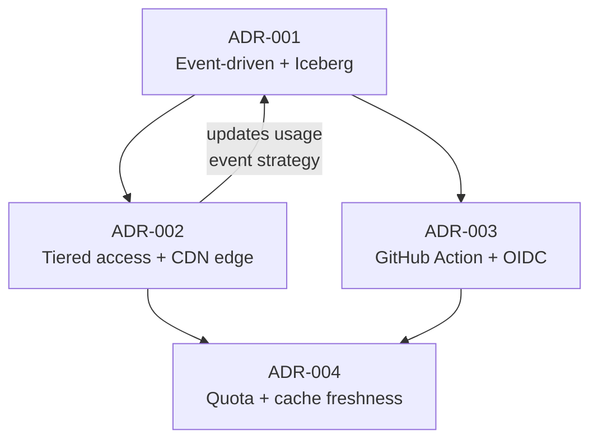

# ADR-005: Architecture Summary (Checkpoint)

**Status**: Living document
**Date**: 2026-03-21
**Authors**: @fforootd

> [!NOTE]
> This ADR is not a decision — it is a **checkpoint** that summarises the current architectural state established by ADRs 001–004. Update this document whenever an ADR is added, accepted, or superseded.

## Current Architecture at a Glance

```
User / CI / Agent
       │
       ▼
Cloudflare CDN  ─── cache hit ──→  Response ($0, no Worker)
       │
   cache miss
       │
       ▼
Cloudflare Worker (Hono)
  ├── Auth (API key / OIDC)
  ├── Rate limit (infra protection)
  ├── Score / Audit
  │     ├── GitHub GraphQL API (8 signals) + REST (CI activity)
  │     └── KV cache (tiered TTL)
  ├── Emit events → Pipelines → Iceberg
  └── Response
       │
       ▼
Cron (every 10 min)
  └── Iceberg SQL → KV materialised views
        (trending, tracked, sitemap, history)
```

## Decision Summary

### ADR-001 — Event-Driven Architecture with Iceberg Data Lake

All data flows through **4 typed event domains** (provider, result, usage, manifest) into Iceberg tables via Cloudflare Pipelines. KV is a materialised view populated by cron — the CQRS pattern. Derived state (trending, tracked, sitemap) has up to 10-minute eventual consistency.

### ADR-002 — Economic Viability: Tiered Access & Cost-Optimised Architecture

Anonymous traffic is served from CDN edge at **zero Worker cost** (`s-maxage=86400`); only authenticated requests wake the Worker and emit usage events. Revenue comes from **prepaid quota tiers** billed per "health check" (dependency scored). Granular anonymous analytics are deferred to Phase 2 (Log Explorer ETL) when revenue justifies the cost.

### ADR-003 — GitHub Action: Dependency Health Auditing in CI


A **composite GitHub Action** hashes manifest content client-side (SHA-256), tries `GET /api/manifest/hash/:hash` for a $0 CDN hit, and falls back to `POST /api/manifest` on miss. Public repos authenticate via **GitHub OIDC** (zero config, 500 deps/month free); private repos use an API key.

### ADR-004 — Quota Accounting & Cache Freshness Tiers

Quota is consumed only when the Worker **actually scores a dependency** (Layer 3 cache miss) — cache hits are free. Authenticated users get **1h KV TTL** for fresher data; anonymous users get **24h**. Enforcement lags ~10 minutes (cron-based), with the rate limiter preventing extreme overshoot.

## How the Decisions Chain Together



- **001 → 002**: The event-driven foundation enabled the two-track model (anonymous = CDN, auth'd = Worker + events).
- **002 → 003**: The CDN caching strategy led to the content-addressed GET endpoint and the Action's hash-first flow.
- **002 + 003 → 004**: Quota accounting defines exactly when events are emitted and what counts as a billable unit.

## Key Invariants

These hold true across all decisions:

| Invariant | Source |
|-----------|--------|
| Anonymous single-repo checks are always free (CDN edge) | ADR-002 |
| Cache hits never consume quota | ADR-004 |
| The billable unit is "dependency scored" (not "request") | ADR-004 |
| Rate limiting is infra protection, not billing | ADR-002 |
| KV is a materialised view, not source of truth | ADR-001 |
| Events are the source of truth (Iceberg) | ADR-001 |
| OIDC auth is zero-config for public repos | ADR-003 |
| Scoring uses GraphQL (most signals) + REST (CI activity) | ADR-001, impl |

## Implementation Status

| Area | Status | Notes |
|------|--------|-------|
| Event domains + Pipelines | ✅ Shipped | 4 pipelines active |
| KV cron aggregation | ✅ Shipped | Trending, tracked, sitemap |
| CDN edge caching (anonymous) | ✅ Shipped | `s-maxage=86400` on check + badge |
| Manifest audit (`POST /api/manifest`) | ✅ Shipped | Hash-based KV caching |
| Content-addressed GET (`/api/manifest/hash/:hash`) | ✅ Shipped | 7-day CDN TTL |
| GitHub Action (`isitalive/audit-action`) | ✅ Shipped | Composite, OIDC + API key |
| OIDC auth middleware | ✅ Shipped | Public-repo validation |
| Score history (aggregate) | ✅ Shipped | On-demand Iceberg query, KV cached 6h |
| Quota enforcement (cron-based) | 🟡 Partial | Read side in manifest route; cron write side not wired |
| Log Explorer ETL (Phase 2) | ⬜ Not started | Deferred until revenue ≥ $1k/mo |
| Lock file parsing | ⬜ Not started | Paid-only, Phase 5 |
| GitHub App gating (paid-only) | ⬜ Not started | Webhook handler accepts all installations |

## Open Questions

- **Exact pricing for paid tiers** — requires cost modelling (GitHub API limits, Pipeline write costs, KV reads per dep)
- **Lock file format coverage** — which formats (yarn.lock, pnpm-lock.yaml, go.sum) to prioritise
- **Scoring algorithm versioning** — how to handle CDN cache invalidation when signals change
